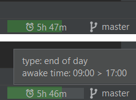
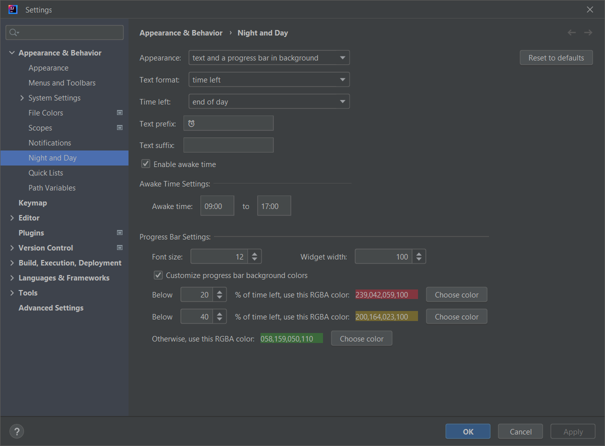

<h1 align="center">
     
    Nigh and Day
</h1>

    
    
    </a>

An IntelliJ IDEA based plugin that shows in Status Bar how much time left in percentage or duration (until the end of day, week, month, year, or a custom date time).  
This plugin is highly inspired from the [Day Night](https://getdaynight.com) application.

1. [Build](#build)  
2. [Contribution](#contribution)  
3. [License](#license)  
4. [Screenshots](#screenshots)  

## Build

Install JDK8+. You should be able to start Gradle Wrapper (`gradlew`).

### Gradle commands

* build plugin: `./gradlew buildPlugin`. See generated ZIP in: `build/distributions/`.
* try plugin in a standalone IDE: `./gradlew runIde`.
* check for dependencies updates: `./gradlew dependencyUpdates`.

## Contribution

Contributions should be tested.        
Please reformat new and modified code only: do not reformat the whole project or entire existing file (in other words, try to limit the amount of changes in order to speed up code review).  
To finish, don't hesitate to add your name or nickname (and LinkedIn profile, etc.) to contributors list ;-)

## License

MIT License. In other words, you can do what you want: this project is entirely OpenSource, Free and Gratis.

## Screenshots

Status bar:

Settings:

